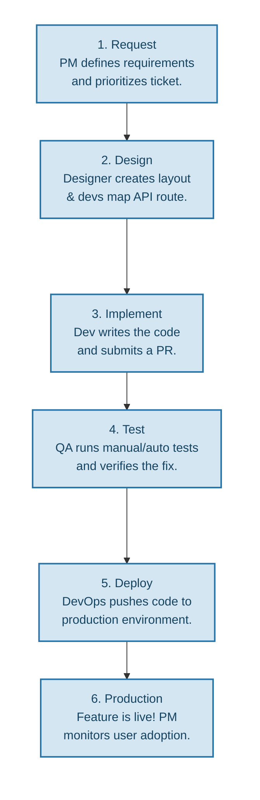

### Day 2

#### Phase Walkthrough

|Phase|Input|Output|
|-|-|-|
|Plan|Raw stakeholder feedback, business goals, or market research.|Software Requirement Specification (SRS) or prioritized backlog.|
|Design|Approved SRS and functional requirements.|System Architecture & UI/UX Wireframes (technical blueprints).|
|Implement|Technical design documents and prioritized tasks/tickets.|Source Code committed to repository (ready for builds).|
|Test|Working software build deployed to a testing/staging environment.|QA Test Report (bug logs and verification sign-offs).|
|Deploy|Fully tested, approved software build.|Live product in the Production Environment accessible to users.|
|Maintain|User feedback, bug reports, and system performance metrics.|Patches, hotfixes, and system updates.|

#### Handsoff

##### Design --> Implemention

- [x] Database schemas and API contracts are defined and agreed upon by the development team.
- [x] System Architecture and UI/UX designs are signed off by stakeholders.
- [x] User stories are fully groomed with explicit acceptance criteria.

##### Test --> Deploy

- [x] All functional (e.g., unit, integration) and non-functional tests (e.g., performance, security) pass with zero critical bugs
- [x] The build meets regulatory standards and passes automated vulnerability scans.
- [x] Release notes are drafted, and the deployment plan (rollback strategy included) is approved.

### Roles Snapshot

|Role|Primary Influence|
|-|-|
|PM/PO|Plan & Analyze (Defining the "what" and "why" based on user value).|
|UX/UI Designer|Design (Creating the user workflows and visual interfaces).|
|Software Developer|Implement (Translating blueprints into clean, working code).|
|QA|Test (Verifying the software meets requirements and is bug-free).|
|DevOps|Deploy & Maintain (Automating pipelines, managing infrastructure, and monitoring uptime).|

### Mini Timeline

