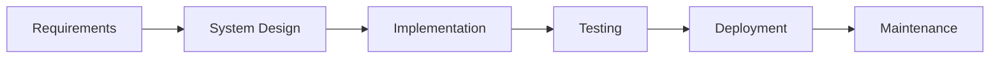
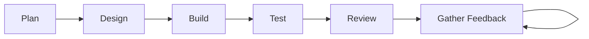

### Day 3

#### Waterfall

##### Strenghts

- Since everything is documented upfront, the budget, timeline, and scope are well-defined from the start.
- Distinct phases with specific deliverables make progress easy to track for management.

##### Weaknesses

- If market needs change midway through, it is incredibly expensive and difficult to go back and change the core requirements
- The client does not see a piece of working software until the very end of the lifecycle (Testing/Deployment).

#### Sketch

- Work is divided into timeboxes called "Sprints" (usually 1 to 4 weeks long)
- Stakeholders get to see working software at the end of every sprint, allowing them to guide the product's direction.
- Because the planning horizon is short, changing priorities are easily accommodated in the next sprint cycle without breaking the project.

### Model Comperation

|Project Type|Recommended Model|Justification|
|-|-|-|
|Core Banking System|Waterfall|A banking system handles massive financial risk and strict legal regulations. It requires comprehensive, heavily audited upfront planning, exact architecture, and rigorous security testing before any user touches it. Agility takes a back seat to stability and compliance.|
|Marketing Landing Page|Agile|Marketing relies on trends, user engagement, and rapid adaptation. You want to launch a Minimum Viable Product (MVP) quickly, run A/B tests, gather user analytics, and tweak the design and copy in rapid, continuous cycles to maximize conversions.|

### Hybrid Reality

In the real world, companies need budget predictability (which Agile struggles with) but want fast development cycles (which Waterfall struggles with). 

|Level|Model||
|-|-|-|
|Macro|Waterfall|High-level requirements, budgeting, and system architecture are planned upfront.|
|Micro|Agile|The actual coding, daily execution, and testing are done in 2-week sprints.|
|Release|Waterfall|Strict, structured deployment and compliance gates are used before pushing to production.|