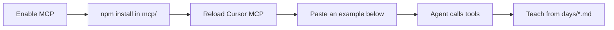

# MasterFabric Academy MCP — Chat Examples

> Copy-paste prompts for Cursor (or any MCP host) once
> [`masterfabric-academy`](./README.md) is enabled.
> All examples below are in **English**.

[← Back to MCP README](./README.md) · [Repo root](../README.md) · [Go roadmap](../days/go/go_roadmap.md) · [Learning paths](../trainee/LEARNING_PATHS.md)

---

## Quick jump

| Goal | Jump |
| ---: | --- |
| First-time Go start | [Example A](#a--start-go-from-day-1) |
| Resume a day | [Example B](#b--resume-go-mid-track) |
| Roadmap / phases | [Example C](#c--roadmap--phase-planning) |
| Cold persona + skill | [Example D](#d--load-personas--skill-then-teach) |
| One-shot paste prompt | [Example E](#e--one-shot-copy-paste-prompt) |
| Expected agent reply shape | [Example F](#f--expected-agent-reply-shape) |
| Tool cheat sheet | [Tools](#tool-cheat-sheet) |
| Smoke checklist | [Smoke test](#smoke-test-checklist) |

---

## Before you chat



1. Install deps → see [Setup](./README.md#setup)
2. Confirm Cursor config → [`.cursor/mcp.json`](../.cursor/mcp.json)
3. Prefer tools over improvisation:
   - `start_learning_session`
   - `get_day_lesson`
   - `guide_next_steps`

---

## A — Start Go from Day 1

### You say

```text
I want to learn Go with MasterFabric Academy.
Start from Day 1 as my lead instructor.
Use the masterfabric-academy MCP.
Keep me on the official day plan and production-minded habits.
```

### Agent should call

| Step | Tool | Args |
| ---: | --- | --- |
| 1 | `start_learning_session` | `track=go`, `day=1`, `learner_goal=Learn Go for backend APIs` |
| 2 | (optional) `get_mentor_persona` | `persona=all` |
| 3 | Teach from returned brief | — |

### What good looks like

- Confirms **Go · Day 1 · Phase 1–5 (Go Fundamentals)**
- Walks **Today's Tasks** in order from [`days/go/1.md`](../days/go/1.md)
- Does **not** invent a parallel syllabus

<details>
<summary>Optional shorter prompt</summary>

```text
MCP masterfabric-academy → start_learning_session
track=go day=1
goal: foundational Go, then APIs
```

</details>

---

## B — Resume Go mid-track

### You say

```text
I'm on Go Day 17 (concurrency).
Finish today's tasks with me, then plan tomorrow.
Stay in the mentor persona stack.
```

### Agent should call

| Step | Tool | Args |
| ---: | --- | --- |
| 1 | `get_day_lesson` | `track=go`, `day=17`, `include_phase=true` |
| 2 | Teach task-by-task | — |
| 3 | `guide_next_steps` | `track=go`, `day=17`, `completed=true`, notes as needed |

### Phase context (reference)

From [`go_roadmap.md`](../days/go/go_roadmap.md):

| Days | Focus |
| :---: | --- |
| **16–20** | Concurrency Basics — goroutines, channels, select, sync, race awareness |

---

## C — Roadmap & phase planning

### You say

```text
Using masterfabric-academy MCP, show the Go roadmap phases.
Where is Auth & Security, and how do I reach it without skipping days?
```

### Agent should call

| Step | Tool | Args |
| ---: | --- | --- |
| 1 | `get_roadmap` | `track=go`, `parsed=true` |
| 2 | Explain phase **51–55** | Auth & Security |
| 3 | `guide_next_steps` | current day → preserve sequence |

### Snapshot (Auth block)

| Days | Focus | Goal |
| :---: | --- | --- |
| **51–55** | Auth & Security | Secure services end to end |

---

## D — Load personas & skill, then teach

### You say

```text
Load the full mentor persona stack and the academy skill,
then start Expo Day 5 as my instructor.
```

### Agent should call

| Step | Tool | Args |
| ---: | --- | --- |
| 1 | `get_mentor_persona` | `persona=all` |
| 2 | `get_academy_skill` | — |
| 3 | `start_learning_session` | `track=expo`, `day=5` |

### Persona stack (default)

| ID | Role |
| --- | --- |
| `lead-instructor` | Day-by-day teaching |
| `staff-engineer` | High-traffic / maintainable systems |
| `security-coach` | Secure defaults |
| `delivery-manager` | Cadence & definition of done |

Conflict priority: **safety → official day goals → production standards → delivery tempo**.

---

## E — One-shot copy-paste prompt

Use this when you want a single message that forces the happy path:

````text
Use the masterfabric-academy MCP.

1) Call start_learning_session with:
   - track: go
   - day: 1
   - learner_goal: "I want production-minded Go APIs"

2) Teach ONLY from the returned day lesson (Today's Tasks in order).

3) After I finish, call guide_next_steps with completed=true.

Rules:
- Stay in mentor personas (instructor + staff engineer + security + delivery).
- Do not invent curriculum outside days/go/.
- Keep answers short: Where I am → Do this next → Check.
````

---

## F — Expected agent reply shape

A strong teaching turn should look like this:

> **Where you are:** Go · Day 1 · Phase 1–5 (Go Fundamentals)  
> **Do this next:** Verify the toolchain with `go version`, then `go mod init`.  
> **Why:** Without a working module, later days block immediately.  
> **Check:** `go version` prints a stable release and `go run .` succeeds.  
> **Stretch (optional):** Enable Go support in your editor.

```text
+-------------------------------------------------------+
|  WHERE YOU ARE                                        |
|  Go · Day 1 · Phase 1-5                               |
+-------------------------------------------------------+
|  DO THIS NEXT                                         |
|  1. go version                                        |
|  2. go mod init example.com/day1                      |
|  3. write main.go Hello World                         |
+-------------------------------------------------------+
|  CHECK                                                |
|  go run .  ->  greeting prints                        |
+-------------------------------------------------------+
```

---

## Tool cheat sheet

| Tool | When to use | Deep link |
| --- | --- | --- |
| `list_tracks` | Discover curricula | [README → tools](./README.md#what-it-provides) |
| `list_personas` | See mentor roles | [Personas](./lib/persona.ts) |
| `get_mentor_persona` | Load system prompts | [Skill: Role](./skills/masterfabric-academy/SKILL.md#role) |
| `get_academy_skill` | Reload day-by-day workflow | [SKILL.md](./skills/masterfabric-academy/SKILL.md) |
| `get_roadmap` | Phase planning | [Go roadmap](../days/go/go_roadmap.md) |
| `get_day_lesson` | Official lesson body | [Day 1 sample](../days/go/1.md) |
| `start_learning_session` | Cold start (best entry) | [Example A](#a--start-go-from-day-1) |
| `guide_next_steps` | Close day / plan tomorrow | [Example B](#b--resume-go-mid-track) |
| `list_days` | Verify day files on disk | [days/go/](../days/go/) |

---

## Smoke test checklist

Use this after enabling the MCP to confirm everything works:

- [ ] `cd mcp && npm install` succeeds → [Setup](./README.md#setup)
- [ ] Cursor shows **masterfabric-academy** connected → [mcp.json](../.cursor/mcp.json)
- [ ] Agent can call `list_tracks` and returns 12 tracks
- [ ] Agent can call `start_learning_session` for `go` / `1`
- [ ] Returned brief includes persona stack + skill + Day 1 tasks
- [ ] Agent follows **Today's Tasks** from [`days/go/1.md`](../days/go/1.md)
- [ ] `guide_next_steps` proposes Day 2 when completed

### Minimal tool-only smoke (for agents)

```text
Call these masterfabric-academy tools in order and summarize results:
1. list_tracks
2. get_mentor_persona (persona=all)
3. start_learning_session (track=go, day=1)
4. guide_next_steps (track=go, day=1, completed=false)
```

---

## More tracks (swap `track=`)

| Track | Sample start | Roadmap |
| --- | --- | --- |
| Go | `track=go` `day=1` | [roadmap](../days/go/go_roadmap.md) |
| Next.js | `track=nextjs` `day=1` | [roadmap](../days/nextjs/nextjs_roadmap.md) |
| NestJS | `track=nestjs` `day=1` | [roadmap](../days/nestjs/nestjs_roadmap.md) |
| Flutter | `track=flutter` `day=1` | [roadmap](../days/flutter/flutter_roadmap.md) |
| Expo | `track=expo` `day=1` | [roadmap](../days/expo/expo_roadmap.md) |
| TypeScript | `track=typescript` `day=1` | [roadmap](../days/typescript/typescript_roadmap.md) |
| GraphQL | `track=graphql` `day=1` | [roadmap](../days/graphql/graphql_roadmap.md) |
| DevOps | `track=devops` `day=1` | [roadmap](../days/devops/devops_roadmap.md) |
| AI Agents | `track=ai-agents` `day=1` | [roadmap](../days/ai-agents/ai-agents_roadmap.md) |
| OOP | `track=oop` `day=1` | [roadmap](../days/oop/oop_roadmap.md) |
| SDLC | `track=sdlc` `day=1` | [roadmap](../days/sdlc/sdlc_roadmap.md) |
| Git | `track=git` `day=1` | [roadmap](../days/git/git_roadmap.md) |

---

## Related docs

| Doc | Purpose |
| --- | --- |
| [MCP README](./README.md) | Setup, tools, layout |
| [Academy skill](./skills/masterfabric-academy/SKILL.md) | Day-by-day teaching rules |
| [Trainee learning paths](../trainee/LEARNING_PATHS.md) | Human-facing path index |
| [Intern PR/commit guide](../interns/pr_and_commit_guide.md) | Professional workflow |
| [Root README](../README.md) | Full academy overview |
